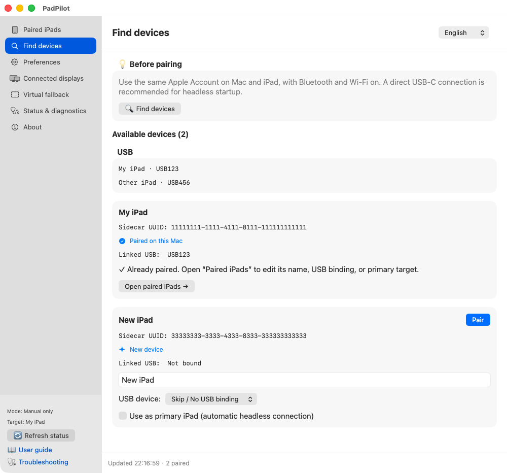
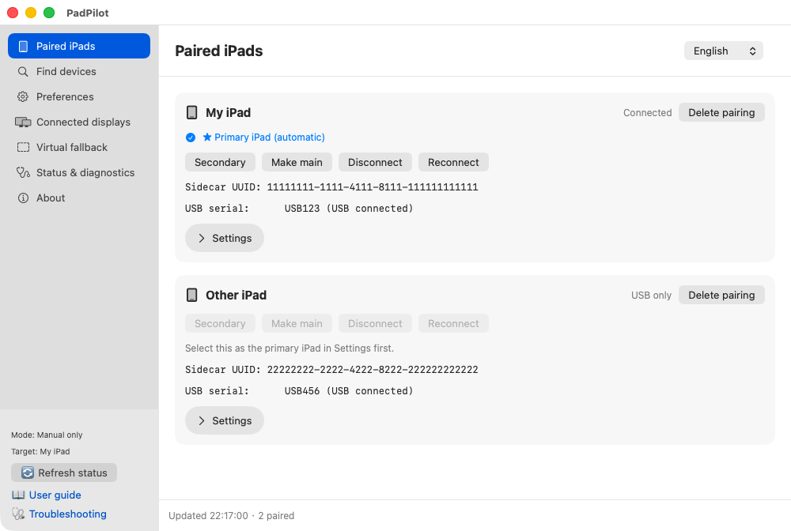
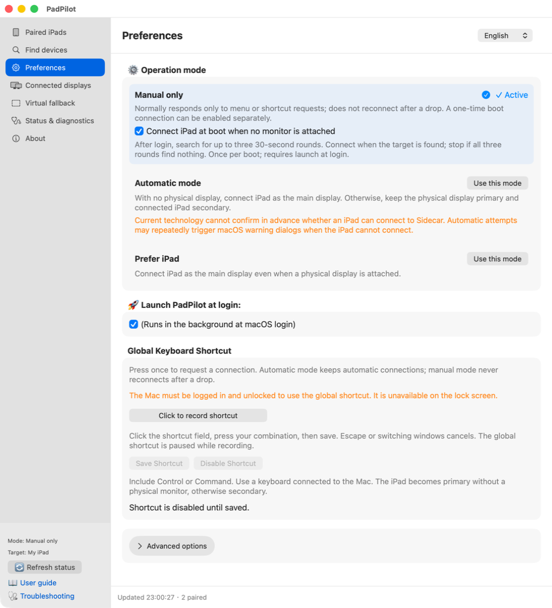
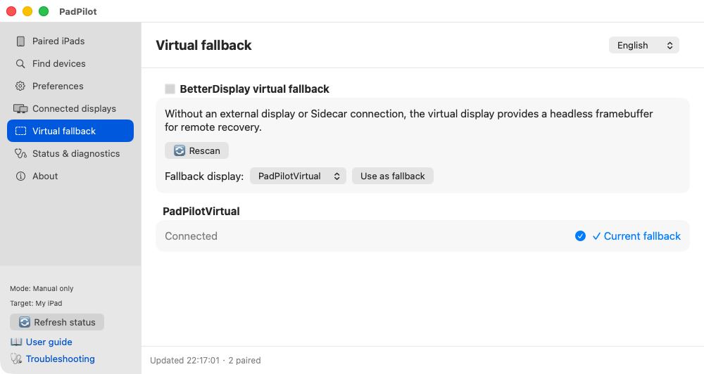

<p align="center">
  
</p>

<h1 align="center">PadPilot</h1>

<p align="center">
  <b>Sidecar display automation for Mac</b><br>
  Let your iPad take the screen.
</p>

<p align="center">
  <a href="README.md">繁體中文</a> | <b>English</b> | <a href="README.ja.md">日本語</a>
</p>

PadPilot lets you use an **iPad as your Mac's main or secondary display**, with Mac mini setups in mind. It works with Apple Sidecar and BetterDisplay for manual connections, switching between main and secondary displays, and automatic takeover when no physical monitor is available, depending on your settings.

**Real-device demo: booting without a physical monitor**

[](docs/videos/headless-boot-demo.mp4)

Filmed on real hardware after initial setup. The boot wait is sped up 8×, and the final frame is held for one extra second. [Watch the higher-quality MP4](docs/videos/headless-boot-demo.mp4).

**[Download for macOS (.dmg)](https://github.com/kcayut/PadPilot/releases)**

<p align="center">
  
  <a href="LICENSE"></a>
  
  
</p>

## Have these three things ready

> [!IMPORTANT]
> **This is an early preview.** Keep a physical monitor or working remote connection available for your first setup.
> PadPilot runs after you log into macOS. It **cannot show FileVault unlock or pre-login screens**; you do not need to disable FileVault to install it.

- **An Apple Silicon Mac running macOS 14+, and a Sidecar-compatible iPad.** Intel Macs are not supported.
- **A working manual Sidecar connection.** Use the same Apple Account with two-factor authentication. For first setup, use a data-capable USB cable and trust the Mac on your iPad. Wireless also needs Wi-Fi, Bluetooth, and Handoff. [Check Apple's requirements](https://support.apple.com/en-us/102597).
- **Install and open [BetterDisplay](https://github.com/waydabber/BetterDisplay) separately.** PadPilot's current features work with the free version; they do not require Pro or an active trial. The standalone CLI alone is not enough; the app's built-in CLI is sufficient.

## Follow the screenshots

These are screenshots of the current native interface using **the project's sample devices**, not evidence of a real hardware connection test. Your device names and status will differ. Click an image to enlarge it.

### 1. Install and open the app

Download the `.dmg` from [GitHub Releases](https://github.com/kcayut/PadPilot/releases), open it, and drag **PadPilot.app into Applications**. Then open the app. Python is included; no Homebrew or compiler tools are needed.

The settings window opens with the app. Closing the window keeps the menu bar icon available. Choose **Settings & pairing** from that menu, or double-click the app, to open it again.

> This preview has no Developer ID signature or Apple notarization. If macOS blocks it, confirm the download source and follow [Apple's instructions](https://support.apple.com/en-us/102445) for “System Settings → Privacy & Security → Open Anyway.” If it says the app is damaged, download it again and verify `SHA256SUMS` first.

### 2. Find your iPad and click Pair

Choose **Find devices → Find devices** in the sidebar. Find your iPad and check its name. Select its USB device if needed, choose it as the primary managed iPad, then click **Pair**. Check the device before accepting any confirmation. Already paired? Go to the next step.

[](docs/images/quick-start/en-search.png)

Pairing lets PadPilot remember a device; it does not replace Apple's account or trust setup. You can save several iPads, but only one is the primary target at a time. With multiple iPads, select the target explicitly instead of relying only on auto-detection.

### 3. Choose how to use your iPad

Open **Paired iPads**. To change the primary managed iPad, expand that device's **Settings**, click “Set as primary iPad,” and confirm.

[](docs/images/quick-start/en-paired.png)

| What you want | Click |
| --- | --- |
| Keep your Mac's main display and extend the desktop | **Secondary** |
| Use the iPad as your main Mac screen | **Make main** |
| Stop using the iPad screen for now | **Disconnect** |
| Try again when the connection gets stuck | **Reconnect** |

Wait for the desktop to appear, then check the roles in **Connected displays**. **“Sidecar detected” means the device was found, not that it is already showing your desktop.**

### 4. Pick manual or automatic control

Open **Preferences**. Start with the default **Manual only** mode; switch modes when you want more automation.

[](docs/images/quick-start/en-settings.png)

| Mode | What it does |
| --- | --- |
| **Manual only** (new-install default) | Connect when you use a button or shortcut. Does not reconnect on its own after disconnection. |
| **Automatic mode** | Prefers a physical monitor when present; otherwise tries to let the iPad take over. An already-connected iPad can remain a secondary display. |
| **Prefer iPad** | Tries to make the iPad the main display even with a physical monitor connected. |

- **Start after login:** enable “Launch PadPilot at login.”
- **Try once on a headless boot:** leave “Connect iPad at boot when no monitor is attached” enabled (the default). In Manual only mode, startup discovery runs for up to three 30-second rounds after login. If the target is found and no physical monitor is present, it attempts one connection cycle. Otherwise it stops; reopening the app during the same boot does not retry.
- **Connect with your keyboard:** scroll to “Global Keyboard Shortcut,” click the recorder, press your key combination, then click “Save Shortcut.”
- **Change language:** use the top-right selector for 繁體中文, English, or 日本語.

Manual choices take priority for the current display arrangement. Mode changes, resets, or display connection changes trigger reevaluation. Updates preserve existing preferences.

### 5. No physical monitor? Set up a fallback

You usually do not need to create one yourself. Install BetterDisplay, then open PadPilot for the first time. When its background service starts, it tries to create `PadPilotVirtual` through BetterDisplay, or reuses an existing virtual display with that name. This is also PadPilot's default fallback, so no extra selection is needed after creation succeeds. Dragging the app from the DMG into Applications alone does not create it.

If automatic creation fails, or you prefer another virtual display, create it in BetterDisplay first. Then refresh the list in **Virtual fallback**, select it and click **Use as fallback**.

Refreshing the list does not retry creation. If you installed BetterDisplay after opening PadPilot, choose Quit from PadPilot's menu and reopen it so the background service can try again.

[](docs/images/quick-start/en-virtual.png)

This keeps a desktop available while the iPad is not ready, and remains available after takeover. Set up Screen Sharing/VNC or SSH beforehand if you need remote recovery; PadPilot does not enable remote access for you.

## If something gets stuck

- **Can't find the iPad?** Check that macOS can connect through Sidecar, then search again. With multiple devices, check the primary target.
- **Clicked Connect but no desktop?** Check Connected displays and Status & diagnostics. A successful command submission is not a completed connection.
- **Displays keep switching?** Choose Manual only and check whether another tool is also changing the main display.

See [Troubleshooting](docs/TROUBLESHOOTING.en.md) for more help. In-app help opens version-specific GitHub documentation in the selected language; private repositories require an account with access.

<details>
<summary>What do the menu bar icons mean?</summary>


From left: Sidecar, physical display, virtual fallback, Manual only, service stopped, warning, working. **The hand means Manual only; pause means the service is stopped.** The hand may still appear with an iPad connected. You can also change languages from the menu bar.

</details>

<details>
<summary>Advanced: USB discovery and connection timing</summary>

Go to Preferences → Advanced options → USB & iPad auto-detection. USB event wakeup and auto-detection are enabled by default. USB events trigger evaluation, alongside a 30-second periodic check.

A selected pairing with a Sidecar UUID takes priority. Otherwise, PadPilot infers a target from a unique USB iPad and Sidecar candidate. This is not proof of identity; with multiple devices, disable auto-detection and pair explicitly. Selected pairings can use wireless Sidecar when available. Unpaired targets inferred only from USB do not initiate wireless connections after unplugging.

Defaults: 4-second debounce, up to 3 connection attempts, 3 seconds between retries, and a 30-second cooldown after failure. These are control timings, not a guarantee of connection speed.

</details>

<details>
<summary>Advanced: Terminal commands and source updates</summary>

Run these from any directory. If `~/bin` is on your PATH, you can also use `padpilot-cli` directly. Installation, update, and development scripts still run from the source directory.

```bash
# Status and settings
"/Applications/PadPilot.app/Contents/Resources/padpilot-cli" status --json
"/Applications/PadPilot.app/Contents/Resources/padpilot-cli" gui
"/Applications/PadPilot.app/Contents/Resources/padpilot-cli" set-language en        # Also accepts zh-Hant or ja

# Operating modes: choose one
"/Applications/PadPilot.app/Contents/Resources/padpilot-cli" set-mode automatic
"/Applications/PadPilot.app/Contents/Resources/padpilot-cli" set-mode manual_only
"/Applications/PadPilot.app/Contents/Resources/padpilot-cli" set-mode prefer_ipad

# Manual actions: choose as needed
"/Applications/PadPilot.app/Contents/Resources/padpilot-cli" action use_ipad_secondary
"/Applications/PadPilot.app/Contents/Resources/padpilot-cli" action use_ipad_main
"/Applications/PadPilot.app/Contents/Resources/padpilot-cli" action disconnect_ipad
"/Applications/PadPilot.app/Contents/Resources/padpilot-cli" action reconnect_sidecar
"/Applications/PadPilot.app/Contents/Resources/padpilot-cli" action refresh
"/Applications/PadPilot.app/Contents/Resources/padpilot-cli" action reset           # Clear temporary override and cooldown

# Background service and launch at login
"/Applications/PadPilot.app/Contents/Resources/padpilot-cli" stop
"/Applications/PadPilot.app/Contents/Resources/padpilot-cli" start
"/Applications/PadPilot.app/Contents/Resources/padpilot-cli" exit                  # Stop service and hide the PadPilot menu
"/Applications/PadPilot.app/Contents/Resources/padpilot-cli" autostart status
"/Applications/PadPilot.app/Contents/Resources/padpilot-cli" autostart toggle

# Version and complete command help
"/Applications/PadPilot.app/Contents/Resources/padpilot-cli" --version
"/Applications/PadPilot.app/Contents/Resources/padpilot-cli" --help
```

Release updates: quit PadPilot, then replace the app at the same location or rerun the release installer. Settings are preserved; choose Python when using the installer. Before changing locations, uninstall the old copy while keeping settings. The following rebuild instructions apply only to source installations.

Keep a backup of the prior source, save and close settings, then update the source and rerun `./scripts/install.sh --check`, `./scripts/install.sh`, and `"/Applications/PadPilot.app/Contents/Resources/padpilot-cli" status`. This also rebuilds the native app. The GUI About page, CLI `--version`, and app share one version source. About also includes GitHub and donation links; donation buttons remain disabled until recipient URLs are configured. The old app is recoverable from Trash, but restoring the app alone does not restore its referenced source.

</details>

## Updates, removal, and more

Save and close settings before updating or uninstalling. For release updates, replace the app at the same location; settings and pairings remain. Before moving the app or migrating from a source installation, uninstall the old copy while keeping settings.

**Remove a release by choosing Exit from the menu, then dragging PadPilot.app from Applications to Trash.** The login service lives inside the app and is managed by macOS; the trashed app will not start background Python. Settings, pairings, and logs remain. Its name may take time to disappear from Login Items.

[Install, update, and uninstall](docs/INSTALLATION.en.md) · [Full documentation index](docs/README.en.md)

Headless cold boot, sleep/wake, and different hardware combinations still need real-device validation. PadPilot does not add Sidecar compatibility or control Universal Control. Report your version, connection type, and reproduction steps; redact serials, UUIDs, accounts, and personal paths before sharing logs.

## Documentation and contributing

- [Installation guide](docs/INSTALLATION.en.md)
- [Troubleshooting and FAQ](docs/TROUBLESHOOTING.en.md)
- [Architecture](docs/ARCHITECTURE.en.md)
- [Documentation index and languages](docs/README.en.md)
- [Changelog](CHANGELOG.md)
- [Contributing guide](CONTRIBUTING.md) and [security policy](SECURITY.md)

The README and user guides under `docs/` are available in Traditional Chinese, English, and Japanese. Development notes are maintained in Traditional Chinese only. Issues, translation improvements, hardware compatibility reports, and pull requests are welcome. After code changes, run `python3 -m unittest discover -s tests -v`; for GUI changes, also follow the layout checks in the contributing guide. Automated tests do not substitute for physical cold-boot or hotplug validation.

## License and acknowledgments

Licensed under the [PolyForm Noncommercial License 1.0.0](LICENSE). Author: **kcayut**. Copyright (c) 2026 kcayut.

- Noncommercial use, modification, and distribution are permitted. Commercial uses outside the license's permitted purposes require separate authorization from the author.
- When distributing source code, binaries, or modified versions, include the license terms or their official URL and preserve every `Required Notice:` author and project attribution in [NOTICE](NOTICE). Built apps include `LICENSE` and `NOTICE`.
- The license also expressly permits use by charitable organizations, educational institutions, public research organizations, public safety or health organizations, environmental protection organizations, and government institutions, regardless of funding. The full license governs these permissions.

This is a source-available noncommercial license, not an OSI open-source license. The change applies to versions provided with this license; it does not revoke rights to versions previously obtained under MIT.

Thanks to [BetterDisplay](https://github.com/waydabber/BetterDisplay) for display control. PadPilot is an independent project, not affiliated with or endorsed by Apple or BetterDisplay.

BetterDisplay is installed separately by the user and is not bundled with PadPilot. Its [license terms](https://github.com/waydabber/BetterDisplay/discussions/739) still apply: non-business users may use free features; business use generally requires Pro, subject to the official exceptions for individual work use.
