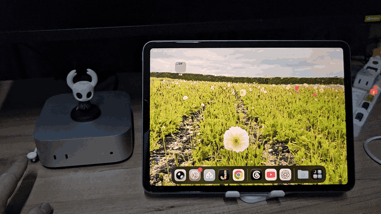
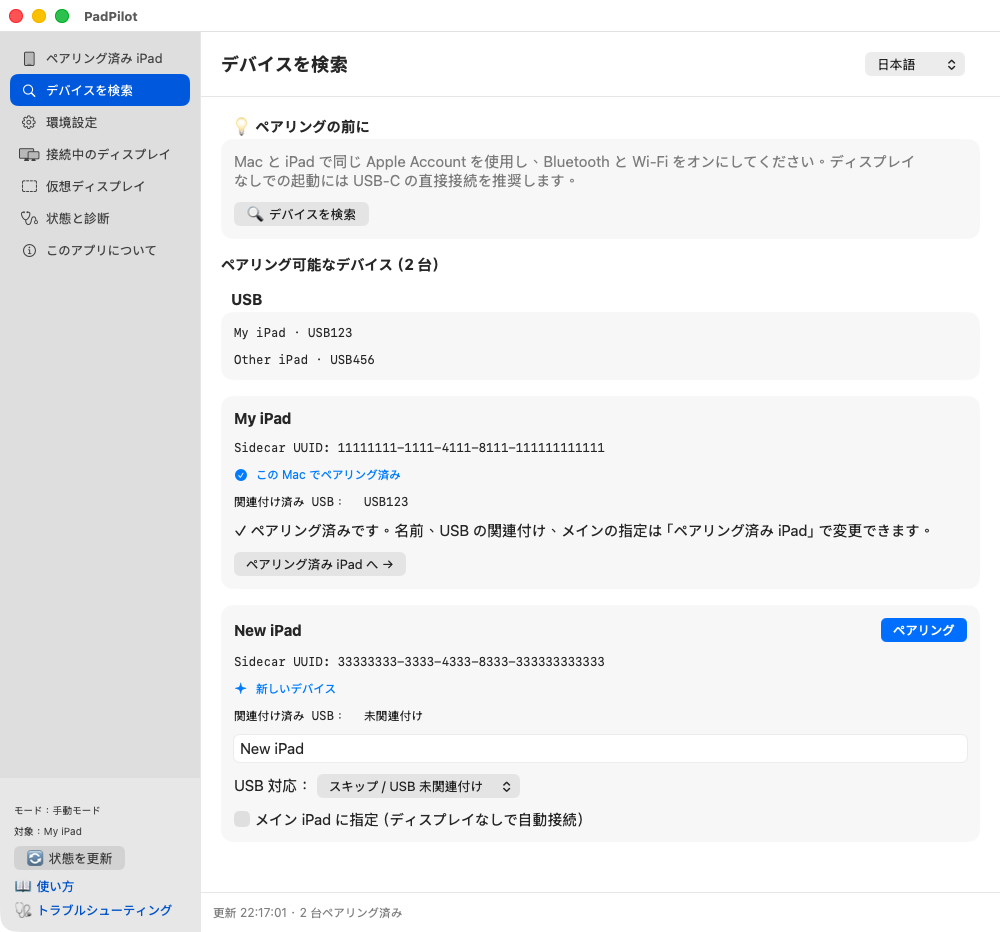
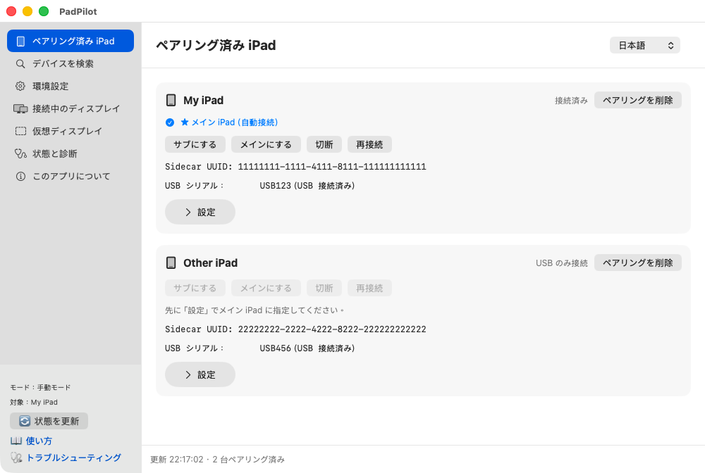
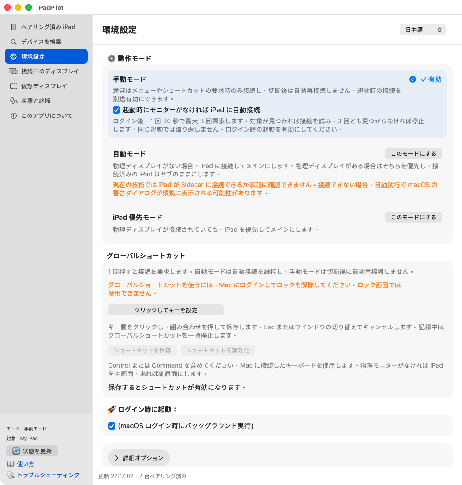
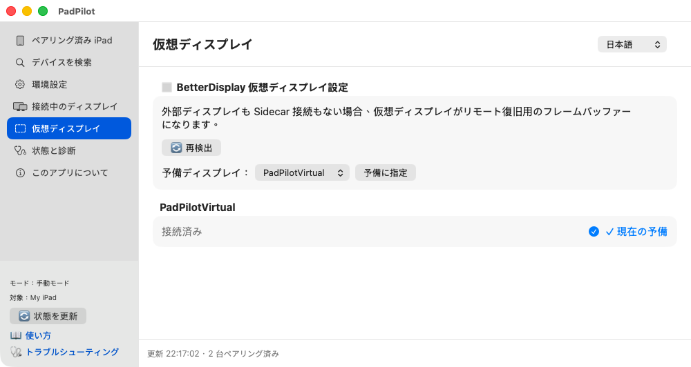
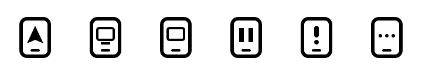

<p align="center">
  
</p>

<h1 align="center">PadPilot</h1>

<p align="center">
  <b>Sidecar display automation for Mac</b><br>
  iPad を、Mac の画面に。
</p>

<p align="center">
  <a href="README.md">繁體中文</a> | <a href="README.en.md">English</a> | <b>日本語</b>
</p>

PadPilot は **iPad を Mac のメイン画面やサブ画面として使う**ためのツールです。主に Mac mini を想定し、Apple Sidecar と BetterDisplay を使って手動接続やメイン／サブ画面の切り替えができます。設定に応じて、物理モニターがないときに iPad へ自動で切り替えることもできます。

**グローバルショートカットで、複数の Mac も手軽に操作。**
複数の Mac mini をサーバーとして使う場合は、キーボードの接続先を操作したい Mac に切り替えます。その Mac にログインしてロックを解除し、iPad が接続可能な状態でショートカットを押すと、その Mac の画面を iPad に表示できます。

**実機デモ：物理モニターなしで起動**

[](docs/videos/headless-boot-demo.mp4)

初期設定済みの実機で撮影。起動の待ち時間は8倍速、最後の画面は1秒長く表示しています。[高画質の MP4 を見る](docs/videos/headless-boot-demo.mp4)。

**[macOS 版をダウンロード（.dmg）](https://github.com/kcayut/PadPilot/releases)**

<p align="center">
  
  <a href="LICENSE"></a>
  
  
</p>

## 先に、この3つを用意

> [!IMPORTANT]
> **現在は初期プレビュー版です。** 初回設定では、物理モニターか使えるリモート接続を残しておいてください。
> PadPilot は macOS へのログイン後に動作します。**FileVault の解除画面やログイン前の画面は表示できません。** インストールのために FileVault を無効にする必要はありません。

- **Apple Silicon Mac（macOS 14 以降）と Sidecar 対応 iPad。** Intel Mac には対応していません。
- **macOS から手動で Sidecar に接続できる状態。** 同じ Apple Account と2ファクタ認証を使います。初回はデータ通信対応の USB ケーブルでつなぎ、iPad で Mac を信頼してください。無線では Wi-Fi、Bluetooth、Handoff も必要です。[Apple の条件を確認](https://support.apple.com/en-us/102597)。
- **[BetterDisplay](https://github.com/waydabber/BetterDisplay) を別途インストールして起動。** 現在の PadPilot の機能は無料版で利用でき、機能上 Pro や有効な試用期間は必要ありません。単体 CLI だけでは動きません。App があれば、内蔵 CLI を使えます。

複数の Mac で使う場合は、各 Mac で PadPilot のペアリングとグローバルショートカットの設定を済ませてください。

## 画面を見ながら始めよう

画像は、現在のネイティブ画面に**プロジェクトのサンプル機器データ**を表示して撮影したものです。実機接続の検証結果ではありません。機器名や状態は環境によって異なります。画像をクリックすると拡大できます。

### 1. インストールして開く

[GitHub Releases](https://github.com/kcayut/PadPilot/releases) から `.dmg` をダウンロードし、**PadPilot.app を Applications にドラッグ**して開きます。Python は同梱済みで、Homebrew やコンパイラーは不要です。

起動すると設定画面が開きます。画面を閉じてもメニューバーは残ります。もう一度開くには、メニューの **「設定とペアリング」**を選ぶか、App をダブルクリックします。

> プレビュー版は Developer ID 署名・Apple 公証を取得していません。macOS にブロックされた場合は入手元を確認し、[Apple の手順](https://support.apple.com/en-us/102445)で「システム設定 → プライバシーとセキュリティ → このまま開く」を使ってください。「壊れている」と表示されたら、まず再ダウンロードして `SHA256SUMS` を確認します。

### 2. iPad を見つけて「ペアリング」

左側の **「デバイスを検索」→「デバイスを検索」**を選びます。自分の iPad を確認し、必要に応じて対応する USB を選択。主管理 iPad に指定して **「ペアリング」**を押します。確認画面が出たら対象を確かめて進みます。登録済みなら次へ。

[](docs/images/quick-start/ja-search.png)

ペアリングは PadPilot に機器を覚えさせる操作です。Apple のアカウントや信頼設定の代わりにはなりません。複数台を保存できますが、主管理対象は一度に1台です。複数の iPad がある場合は、自動検出だけに頼らず対象を指定してください。

### 3. 使い方に合わせてボタンを押す

**「ペアリング済み iPad」**を開きます。主管理対象を変えるには、その機器の **「設定」**を開き、「メイン iPad に指定」を押し、確認します。

[](docs/images/quick-start/ja-paired.png)

| やりたいこと | 押すボタン |
| --- | --- |
| Mac のメイン画面を残して、作業領域を広げる | **サブにする** |
| iPad を Mac のメイン画面にする | **メインにする** |
| いったん iPad の画面を使うのをやめる | **切断** |
| 接続がうまくいかないのでやり直す | **再接続** |

デスクトップが表示されるのを待ち、**「接続中のディスプレイ」**で役割を確認します。**「Sidecar を検出」は機器が見つかった状態で、画面表示の完了を意味しません。**

画面の判定が違う場合は、そのカードの **「物理ディスプレイ判定から除外」**をオン／オフにできます。物理モニターの有無の判定だけに影響し、画面の制御や表示は停止しません。`Generic`／`Generic Display` は既定で除外されますが、実物のモニターならチェックを外せます。「自動判定に戻す」で既定に戻せます。**すべての物理モニターを除外すると、自動モードはモニターがないものとして iPad への接続を試みる場合があります。** [詳しい説明](docs/TROUBLESHOOTING.ja.md#generic-display)

### 4. 手動か自動かを選ぶ

**「環境設定」**を開きます。最初は既定の **「手動モード」**で試し、自動化したくなったらモードを切り替えましょう。

[](docs/images/quick-start/ja-settings.png)

| モード | 動作 |
| --- | --- |
| **手動モード**（新規インストール時の既定） | ボタンやショートカットで接続します。切断後の自動再接続はしません。 |
| **自動モード** | 物理モニターがあれば優先し、なければ iPad への切り替えを試みます。接続済み iPad はサブ画面として残せます。 |
| **iPad 優先モード** | 物理モニターがあっても、iPad をメイン画面にすることを優先します。 |

- **ログイン後に起動したい：**「ログイン時に起動」を有効にします。
- **モニターなしの起動時に一度試したい：**「起動時にモニターがなければ iPad に自動接続」を有効のままにします（既定で有効）。手動モードではログイン後、30秒ずつ最大3回探索します。対象が見つかり物理モニターがなければ、1サイクルの接続を試みます。見つからなければ停止し、同じ起動中に App を開き直しても再試行しません。
- **キーボードで接続したい：** 下にスクロールして「グローバルショートカット」の記録ボタンを押し、キーの組み合わせを入力して保存します。
- **言語を変えたい：** 右上で繁體中文、English、日本語から選べます。

現在の画面構成では手動指定が優先されます。モード変更、リセット、画面の抜き差しで再評価します。更新時は既存の設定を引き継ぎます。

### 5. 物理モニターがないなら、代替画面を用意

通常は自分で作成する必要はありません。BetterDisplay をインストールしてから PadPilot を初めて開くと、バックグラウンドサービスの起動時に BetterDisplay を通じて `PadPilotVirtual` の自動作成を試みます。同名の仮想ディスプレイがあれば、そのまま使います。これは既定の代替画面なので、作成に成功すれば改めて指定する必要はありません。DMG から「アプリケーション」にドラッグするだけでは作成されません。

自動作成されなかった場合や、別の仮想ディスプレイを使いたい場合は、BetterDisplay で作成してください。その後、**「仮想ディスプレイ」**で一覧を更新し、対象を選んで **「予備に指定」**を押します。

一覧の更新では作成を再試行しません。PadPilot を開いた後に BetterDisplay をインストールした場合は、PadPilot のメニューから「終了」を選んで開き直すと、バックグラウンドサービスが再び作成を試みます。

[](docs/images/quick-start/ja-virtual.png)

iPad の準備ができていない間もデスクトップを維持し、切り替え後も残ります。リモート復旧が必要なら、Screen Sharing／VNC または SSH を事前に設定してください。PadPilot がリモートアクセスを有効にすることはありません。

## 困ったら、まずここを確認

- **iPad が見つからない：** macOS から Sidecar 接続できるか確認して再検索。複数台なら主管理対象も確認します。
- **ボタンを押しても画面が出ない：**「接続中のディスプレイ」と「状態と診断」で原因を確認します。命令の送信成功と接続完了は別です。
- **画面が何度も切り替わる：**「手動モード」にして、ほかのツールもメイン画面を変更していないか確認します。

詳しくは[トラブルシューティング](docs/TROUBLESHOOTING.ja.md)へ。App 内のヘルプは、選択言語・対象バージョンの GitHub 文書を開きます。

<details>
<summary>メニューバーのアイコンの意味</summary>



左から Sidecar、物理画面、仮想代替、手動モード、サービス停止、警告、処理中です。**指は手動モード、一時停止はサービス停止**を表します。iPad 接続中でも指の表示になることがあります。言語はメニューバーからも変更できます。

</details>

<details>
<summary>詳細：USB 自動検出と接続の待ち時間</summary>

「環境設定 → 詳細オプション → USB と iPad の自動検出」で設定します。USB イベントによる評価と自動検出は既定で有効です。USB イベントで評価し、30秒ごとの定期確認も行います。

Sidecar UUID を持つ指定済みペアリングを優先し、なければ単一の USB iPad と Sidecar 候補から推定します。推定は同一機器の証明ではないため、複数台では自動検出を無効にして対象を指定してください。指定済み機器は利用可能なら無線 Sidecar を使えますが、USB だけで推定した未登録機器は抜線後に無線接続を新規開始しません。

既定は切り替え前の待機4秒、接続試行は最大3回、間隔3秒、失敗後の待機30秒です。接続完了時間を保証する数値ではありません。

</details>

<details>
<summary>詳細：ターミナルのコマンドとソース版の更新</summary>

どのフォルダーからでも実行できます。`~/bin` が PATH にあれば `padpilot-cli` だけでも実行できます。導入・更新・開発用スクリプトはソースフォルダーで実行してください。

```bash
# 状態と設定
"/Applications/PadPilot.app/Contents/Resources/padpilot-cli" status --json
"/Applications/PadPilot.app/Contents/Resources/padpilot-cli" gui
"/Applications/PadPilot.app/Contents/Resources/padpilot-cli" set-language ja        # zh-Hant または en も使用可能

# 動作モード：いずれかを選択
"/Applications/PadPilot.app/Contents/Resources/padpilot-cli" set-mode automatic
"/Applications/PadPilot.app/Contents/Resources/padpilot-cli" set-mode manual_only
"/Applications/PadPilot.app/Contents/Resources/padpilot-cli" set-mode prefer_ipad

# 手動操作：必要に応じて実行
"/Applications/PadPilot.app/Contents/Resources/padpilot-cli" action use_ipad_secondary
"/Applications/PadPilot.app/Contents/Resources/padpilot-cli" action use_ipad_main
"/Applications/PadPilot.app/Contents/Resources/padpilot-cli" action disconnect_ipad
"/Applications/PadPilot.app/Contents/Resources/padpilot-cli" action reconnect_sidecar
"/Applications/PadPilot.app/Contents/Resources/padpilot-cli" action refresh
"/Applications/PadPilot.app/Contents/Resources/padpilot-cli" action reset           # 一時指定とクールダウンを解除

# サービスとログイン時起動
"/Applications/PadPilot.app/Contents/Resources/padpilot-cli" stop
"/Applications/PadPilot.app/Contents/Resources/padpilot-cli" start
"/Applications/PadPilot.app/Contents/Resources/padpilot-cli" exit                  # サービスを停止し、メニューを閉じる
"/Applications/PadPilot.app/Contents/Resources/padpilot-cli" autostart status
"/Applications/PadPilot.app/Contents/Resources/padpilot-cli" autostart toggle

# バージョンとヘルプ
"/Applications/PadPilot.app/Contents/Resources/padpilot-cli" --version
"/Applications/PadPilot.app/Contents/Resources/padpilot-cli" --help
```

リリースの更新：PadPilot を終了し、同じ場所のアプリを新版に置き換えるか、リリース用スクリプトを再実行します。設定を保持し、スクリプトでは Python を選択します。場所を変更する場合は旧版を先に削除して設定を残します。以下の再ビルド手順はソース版のみが対象です。

更新前に旧ソースをバックアップし、設定を保存して画面を閉じます。更新後は `./scripts/install.sh --check`、`./scripts/install.sh`、`python3 bin/padpilot-cli status`（インストール時に選んだ Python を使用）を再実行し、アプリも再ビルドします。更新時は既存アプリの場所を維持し、ソースからの新規インストールは `~/Applications/PadPilot.app` が既定です。GUI の「このアプリについて」、CLI `--version`、アプリは同じバージョン定義を使います。同ページには GitHub、PayPal、Ko-fi、歐付寶、綠界科技の支援リンクもあります。設定は保持され、旧アプリはゴミ箱にありますが、アプリだけを戻しても参照するソースは戻りません。

</details>

## 更新・削除と詳しい説明

更新・削除前に設定を保存して画面を閉じてください。リリース版は同じ場所の App を新版に置き換えれば、設定とペアリングを引き継ぎます。場所の変更やソース版からの移行では、旧版を先に削除して設定を残してください。

**リリース版を削除するには、メニューの「終了」を選び、Applications の PadPilot.app をゴミ箱へ移します。** ログインサービスはアプリ内にあり、macOS が管理します。ゴミ箱内のアプリはバックグラウンド Python を起動しません。設定・ペアリング・ログは保持され、ログイン項目の名前が消えるまで時間がかかる場合があります。

[インストール・更新・アンインストール](docs/INSTALLATION.ja.md) · [ドキュメント一覧](docs/README.ja.md)

モニターなしのコールドブート、スリープ復帰、各種機器構成は実機検証が必要です。Sidecar 非対応機器を対応させたり、Universal Control を操作したりする機能はありません。問題報告にはバージョン、接続方法、再現手順を添え、ログのシリアル番号・UUID・アカウント・個人のパスは伏せてください。

## ドキュメントと貢献

- [インストールガイド](docs/INSTALLATION.ja.md)
- [トラブルシューティング・FAQ](docs/TROUBLESHOOTING.ja.md)
- [アーキテクチャ](docs/ARCHITECTURE.ja.md)
- [文書一覧と言語版](docs/README.ja.md)
- [変更履歴](CHANGELOG.md)
- [貢献ガイド](CONTRIBUTING.md)と[セキュリティ方針](SECURITY.md)

README と `docs/` 内のユーザー向けガイドは繁体字中国語、英語、日本語で読めます。開発記録は繁体字中国語のみで管理します。問題報告、翻訳改善、互換性情報、Pull Request を歓迎します。コード変更後は `python3 -m unittest discover -s tests -v` を実行し、GUI 変更時は貢献ガイドのレイアウト確認も行ってください。自動テストは実際のコールドブートや抜き差し検証の代わりにはなりません。

## PadPilot を支援

PadPilot の全機能は現在無料で利用できます。気に入っていただけたら、開発を応援していただけるとうれしいです。ありがとうございます！

<!-- Brand assets: https://www.paypalobjects.com/paypal-ui/logos/svg/paypal-mark-color.svg | https://storage.ko-fi.com/cdn/cup-border.png | O’Pay and ECPay logos supplied by the project owner -->
<table>
  <tr>
    <td align="center" width="160">
      <a href="https://www.paypal.com/paypalme/oilstuck">
        <br>
        <strong>PayPal</strong>
      </a>
    </td>
    <td align="center" width="160">
      <a href="https://ko-fi.com/kcayut">
        <br>
        <strong>Ko-fi</strong>
      </a>
    </td>
    <td align="center" width="220">
      <a href="https://payment.opay.tw/Broadcaster/Donate/6CF8CF9E519E0ED13E244399607ADDD7">
        <br>
        <strong>歐付寶（O’Pay）</strong>
      </a><br>
      歐付寶会員番号：2218408
    </td>
    <td align="center" width="160">
      <a href="https://p.ecpay.com.tw/A2FA21C">
        <br>
        <strong>綠界科技（ECPay）</strong>
      </a>
    </td>
  </tr>
</table>

## ライセンスと謝辞

[PolyForm Noncommercial License 1.0.0](LICENSE) を採用しています。作者：**kcayut**。Copyright (c) 2026 kcayut.

- 非商用目的での使用、変更、再配布を許可します。ライセンスの許可範囲外の商用利用には、作者から別途許諾を得る必要があります。
- ソースコード、実行ファイル、変更版を配布する際は、ライセンス本文または公式 URL を添え、[NOTICE](NOTICE) の `Required Notice:` で始まる作者・プロジェクト出典の表示をすべて保持してください。ビルドした App には `LICENSE` と `NOTICE` が同梱されます。
- 慈善団体、教育機関、公的研究機関、公共安全・保健機関、環境保護団体、政府機関による使用も、資金源にかかわらず明示的に許可されています。詳細はライセンス原文に従います。

ソースを入手できる非商用ライセンスであり、OSI の定義によるオープンソースライセンスではありません。本ライセンスは、このライセンス文書が同梱された版に適用されます。以前に MIT ライセンスで取得した版の権利には影響しません。

画面制御機能を提供する [BetterDisplay](https://github.com/waydabber/BetterDisplay) に感謝します。PadPilot は独立したプロジェクトであり、Apple や BetterDisplay との提携・公式サポートを示すものではありません。

BetterDisplay は別途インストールするもので、PadPilot には同梱していません。現在の PadPilot の機能に BetterDisplay Pro や試用資格は必要ありません。BetterDisplay 自身の[ライセンス条件](https://github.com/waydabber/BetterDisplay/discussions/739)は引き続き適用されます。
