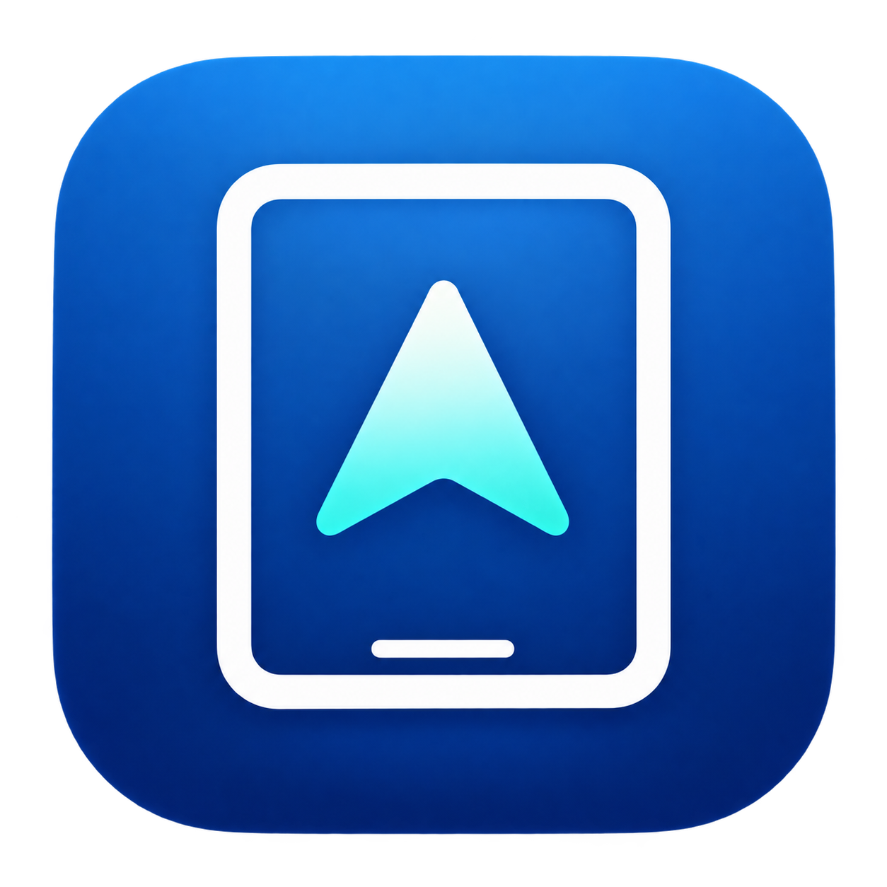
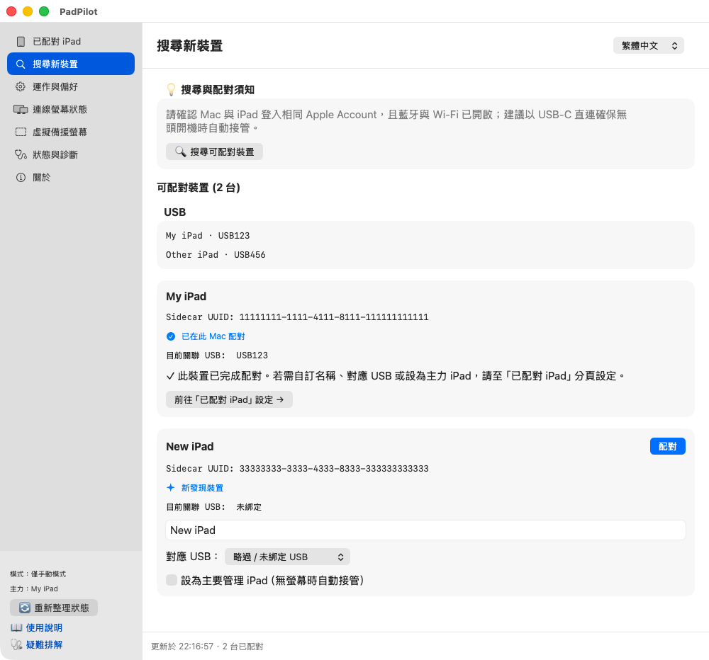
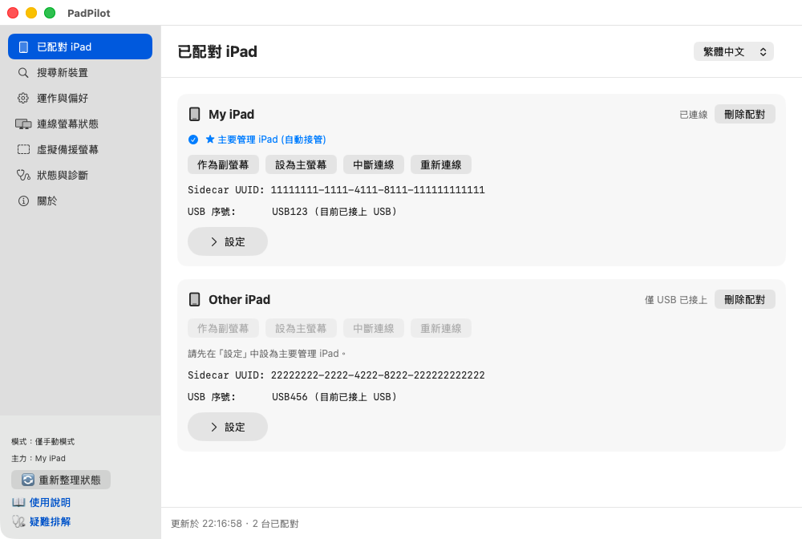
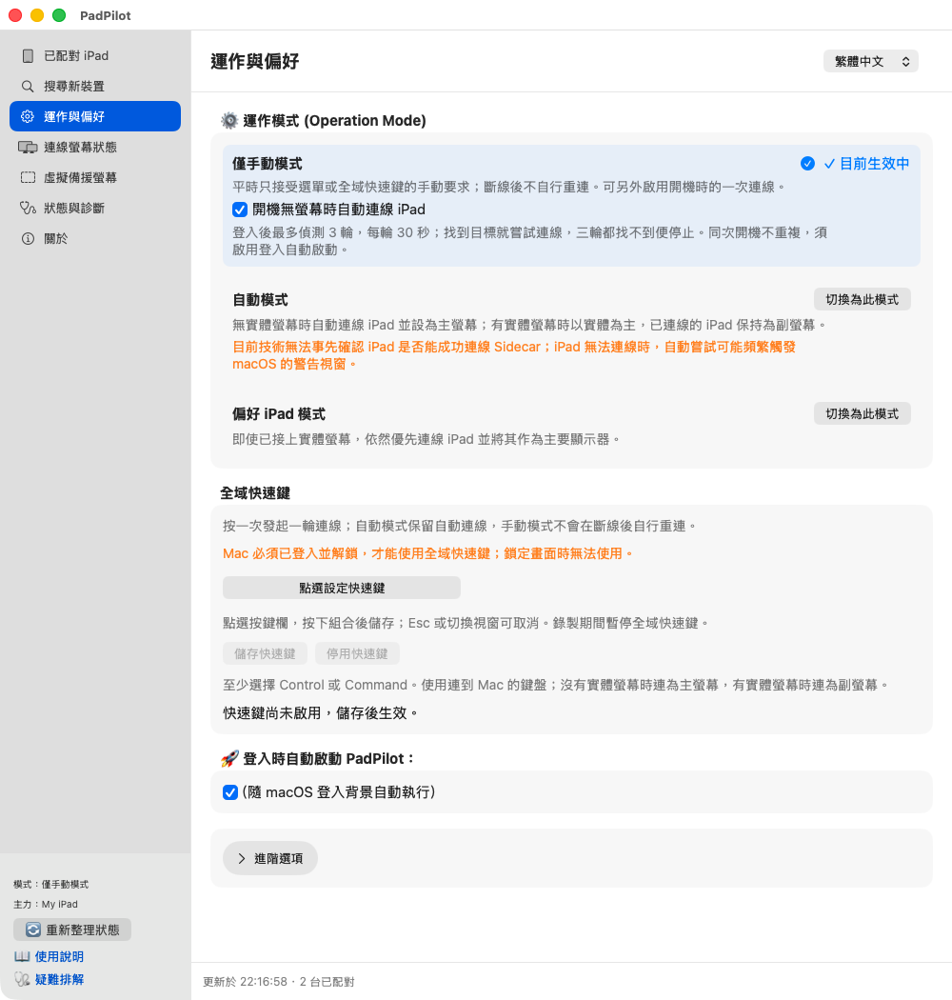
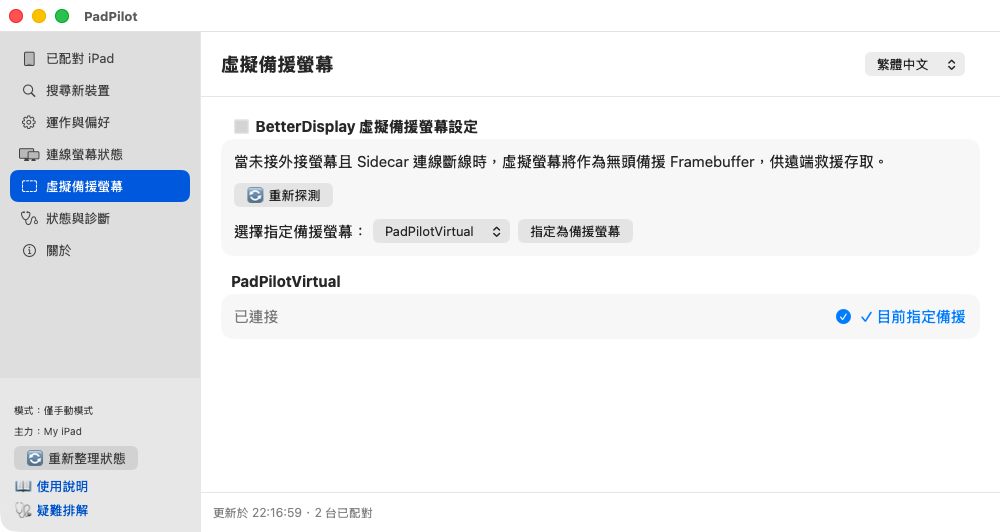

<p align="center">
  
</p>

<h1 align="center">SidecarSwitch</h1>

<p align="center">
  <b>iPad 螢幕自動連線與切換工具</b><br>
  讓 iPad 接手你的 Mac 螢幕。
</p>

<p align="center">
  <b>繁體中文</b> | <a href="README.en.md">English</a> | <a href="README.ja.md">日本語</a>
</p>

<p align="center">
  🌐 <a href="https://kcayut.github.io/PadPilot/">介紹網站</a>
</p>

SidecarSwitch 讓你用 **iPad 當 Mac 的主螢幕或副螢幕**，主要為 Mac mini 設計。搭配 Apple Sidecar 與 BetterDisplay，可以手動連線、切換主／副螢幕，也能依設定在沒有實體螢幕時自動接手。

**支援全域快速鍵，多台 Mac 也能方便操作。**
使用多台 Mac mini 當伺服器時，將鍵盤切換到指定的 Mac，在該機已登入並解鎖、iPad 可連線的狀態下，按下快捷鍵，就能讓 iPad 顯示這台 Mac 的畫面。

**實機示範：無實體螢幕開機**

[](docs/videos/headless-boot-demo.mp4)

開發版實機示範，已完成首次設定；不同版本與硬體仍需個別驗證。開機等待段加速 8 倍，最後畫面多停 1 秒。[觀看清晰版 MP4](docs/videos/headless-boot-demo.mp4)。

**[查看發行版本](https://github.com/kcayut/PadPilot/releases)**

<p align="center">
  
  <a href="LICENSE"></a>
  
  
</p>

## 先準備好這三樣

> [!IMPORTANT]
> **目前是早期預覽版。** 第一次使用，請保留實體螢幕或可用的遠端連線。
> SidecarSwitch 在登入 macOS 後才運作，**不能顯示 FileVault 解鎖或登入前畫面**；不需要為了安裝而關閉 FileVault。

- **Apple Silicon Mac、macOS 14+，以及支援 Sidecar 的 iPad**。目前不支援 Intel Mac。
- **先讓 Sidecar 能手動連上**：兩台裝置使用相同 Apple Account 並開啟雙重認證。初次設定建議用資料傳輸線連接，在 iPad 上信任 Mac；無線另需 Wi-Fi、藍牙與 Handoff。[查看 Apple 的條件](https://support.apple.com/en-us/102597)。
- **自行安裝並開啟 [BetterDisplay](https://github.com/waydabber/BetterDisplay)**。目前 SidecarSwitch 的功能可搭配免費版使用，功能上不要求 Pro 或試用資格。只裝獨立 CLI 不夠；已有 App 就不必另外裝 CLI。

多台 Mac 搭配使用時，各台 Mac 需先完成 SidecarSwitch 配對與全域快速鍵設定。

SidecarSwitch 的預編譯安裝包準備中，目前可依[原始碼安裝說明](docs/INSTALLATION.md#source-installation)安裝。

## 跟著畫面開始用

以下為原生介面的操作示範截圖，使用專案內建的**示範裝置資料**，不代表實機連線驗收。你的裝置名稱與狀態會不同；點圖可放大。

### 1. 安裝，打開 App

從 [GitHub Releases](https://github.com/kcayut/PadPilot/releases) 下載 `.dmg`，打開後把 **SidecarSwitch.app 拖進 Applications**，再開啟 App。已內建 Python，不必另裝 Homebrew 或編譯工具。

開啟後就會看到設定視窗。關掉視窗，選單列仍會保留；要再開設定，點選單列的 **「設定與配對」**，或再雙擊 App。

> 預覽版尚未經 Developer ID 簽署或 Apple 公證。若 macOS 擋下開啟，確認下載來源後，依 [Apple 說明](https://support.apple.com/en-us/102445) 到「系統設定 → 隱私權與安全性 → 仍要打開」。若顯示損毀，先重新下載並核對 `SHA256SUMS`。

### 2. 找到你的 iPad，按「配對」

左邊選 **「搜尋新裝置」→「搜尋可配對裝置」**。找到你的 iPad，確認名稱；需要時選擇對應 USB，勾選主要管理 iPad，再按 **「配對」**。若跳出確認視窗，核對裝置後再繼續；已配對的裝置直接到下一步。

[](docs/images/quick-start/zh-Hant-search.png)

配對只是讓 SidecarSwitch 記住這台裝置，不會取代 Apple 的帳號或信任設定。可以儲存多台，但一次只管理一台主要目標；有多台 iPad 時，請明確指定，別只靠自動偵測。

### 3. 想怎麼用，直接按

左邊選 **「已配對 iPad」**。要更換主要管理的 iPad，展開該裝置的 **「設定」**，按「設為主要管理 iPad」，確認後套用。

[](docs/images/quick-start/zh-Hant-paired.png)

| 你想做的事 | 按這個 |
| --- | --- |
| 保留 Mac 原本的主螢幕，讓 iPad 延伸桌面 | **作為副螢幕** |
| 主要在 iPad 上操作 Mac | **設為主螢幕** |
| 暫時不用 iPad 畫面 | **中斷連線** |
| 連線卡住，想再試一次 | **重新連線** |

按下後等畫面出現，再到 **「連線螢幕狀態」**確認主／副螢幕。**「已偵測到 Sidecar」只代表找到裝置，還不等於已經顯示桌面。**

若螢幕被誤判，可在這一頁的螢幕卡片勾選或取消 **「排除實體螢幕判斷」**；設定只影響它是否計入「有實體螢幕」，不會停止控制或關閉螢幕。`Generic`／`Generic Display` 預設排除，真實螢幕可取消勾選；也可按「恢復自動判斷」。**排除所有實體螢幕後，自動模式會視為沒有實體螢幕，並可能嘗試連線 iPad。** [詳細說明](docs/TROUBLESHOOTING.md#generic-display)

### 4. 決定要自己控制，還是自動連線

左邊選 **「運作與偏好」**。剛開始可維持預設的 **「僅手動模式」**；想更自動，再切換模式。

[](docs/images/quick-start/zh-Hant-settings.png)

| 模式 | 怎麼運作 |
| --- | --- |
| **僅手動模式**（新安裝預設） | 平時由你按按鈕或快速鍵連線，斷線後不自行重連。 |
| **自動模式** | 有實體螢幕就以它為主；沒有時嘗試讓 iPad 接手。已連上的 iPad 可保留為副螢幕。 |
| **偏好 iPad 模式** | 即使有實體螢幕，也優先嘗試讓 iPad 當主螢幕。 |

- **想登入後就啟動**：勾選「登入時自動啟動 SidecarSwitch」。
- **想無螢幕開機時先試一次**：保留「開機無螢幕時自動連線 iPad」（預設勾選）。在手動模式下，登入後最多找 3 輪、每輪 30 秒；找到目標且無實體螢幕時，嘗試一輪連線。找不到就停止，同次開機重開 App 不會再試。
- **想用鍵盤連線**：往下找到「全域快速鍵」，按錄製按鈕、按下組合鍵，再按「儲存快速鍵」。
- **想換語言**：用視窗右上角選單，支援繁體中文、English、日本語。

手動選擇會在目前螢幕連接組合內優先；切換模式、重設或插拔螢幕後會重新評估。更新會保留既有偏好。

### 5. 沒有實體螢幕？先準備備援

通常不需要自己建立。先安裝 BetterDisplay，再首次開啟 SidecarSwitch；背景服務啟動時，會嘗試透過 BetterDisplay 自動建立 `SidecarSwitchVirtual`。已有同名虛擬螢幕就會沿用。它也是 SidecarSwitch 的預設備援，建立成功後不必再指定。只把 App 從 DMG 拖到「應用程式」還不會建立。

若沒有自動建立，或想使用其他虛擬螢幕，請先在 BetterDisplay 建立，再回 **「虛擬備援螢幕」**按 **「重新探測」**，選取它並按 **「指定為備援螢幕」**。

「重新探測」只更新清單，不會重試建立。若是開啟 SidecarSwitch 後才安裝 BetterDisplay，可從 SidecarSwitch 選單選「結束」再重新開啟，讓背景服務再次嘗試。

[](docs/images/quick-start/zh-Hant-virtual.png)

它能在 iPad 尚未接手時保留桌面，iPad 接手後也會保留。需要遠端救援的話，請事先自行設定 Screen Sharing／VNC 或 SSH；SidecarSwitch 不會替你開啟遠端存取。

## 卡住時，先看這裡

- **找不到 iPad**：先確認 macOS 本身能用 Sidecar，再回「搜尋新裝置」搜尋。多台裝置時確認主要管理目標。
- **按了卻沒畫面**：到「連線螢幕狀態」和「狀態與診斷」看原因；連線需要時間，命令送出成功不代表已完成。
- **畫面一直切來切去**：先改成「僅手動模式」，檢查是否有其他工具也在調整主螢幕。

更多問題看[疑難排解](docs/TROUBLESHOOTING.md)。GUI 內的說明連結會開啟 GitHub 上對應版本、對應語言的文件。

<details>
<summary>選單列圖示怎麼看？</summary>


由左至右：Sidecar、實體螢幕、虛擬備援、僅手動、服務停止、警告、處理中。**手指代表僅手動模式，暫停代表服務已停止**；iPad 連上時仍可能顯示手指。語言也可從選單列切換。

</details>

<details>
<summary>進階：USB 自動偵測與連線等待</summary>

位置：「運作與偏好 → 進階選項 → USB 與 iPad 自動偵測」。USB 插拔喚醒與自動偵測預設開啟；USB 事件會喚醒評估，並保留 30 秒定期檢查。

有指定且具 Sidecar UUID 的配對時，優先使用它；沒有時才從唯一 USB iPad 與 Sidecar 候選推定。推定不是身分確認，多台裝置時請停用自動偵測並明確配對。指定配對可依 Sidecar 可用性使用無線；只靠 USB 推定的未配對目標，拔線後不會主動建立無線連線。

預設防抖 4 秒、連線最多 3 次、間隔 3 秒，失敗後冷卻 30 秒。這些是等待規則，不是連線完成時間的保證。

</details>

<details>
<summary>進階：終端機指令與原始碼更新</summary>

以下指令可從任何目錄執行。若 `~/bin` 位於 PATH，也可直接使用 `sidecarswitch-cli`。安裝、更新及開發腳本仍須在原始碼目錄執行。

```bash
# 狀態與設定
"/Applications/SidecarSwitch.app/Contents/Resources/sidecarswitch-cli" status --json
"/Applications/SidecarSwitch.app/Contents/Resources/sidecarswitch-cli" gui
"/Applications/SidecarSwitch.app/Contents/Resources/sidecarswitch-cli" set-language zh-Hant   # 亦可使用 en 或 ja

# 運作模式：擇一設定
"/Applications/SidecarSwitch.app/Contents/Resources/sidecarswitch-cli" set-mode automatic
"/Applications/SidecarSwitch.app/Contents/Resources/sidecarswitch-cli" set-mode manual_only
"/Applications/SidecarSwitch.app/Contents/Resources/sidecarswitch-cli" set-mode prefer_ipad

# 手動操作：依需要選擇
"/Applications/SidecarSwitch.app/Contents/Resources/sidecarswitch-cli" action use_ipad_secondary
"/Applications/SidecarSwitch.app/Contents/Resources/sidecarswitch-cli" action use_ipad_main
"/Applications/SidecarSwitch.app/Contents/Resources/sidecarswitch-cli" action disconnect_ipad
"/Applications/SidecarSwitch.app/Contents/Resources/sidecarswitch-cli" action reconnect_sidecar
"/Applications/SidecarSwitch.app/Contents/Resources/sidecarswitch-cli" action refresh
"/Applications/SidecarSwitch.app/Contents/Resources/sidecarswitch-cli" action reset           # 清除暫時覆寫與冷卻狀態

# 背景服務與登入自動啟動
"/Applications/SidecarSwitch.app/Contents/Resources/sidecarswitch-cli" stop
"/Applications/SidecarSwitch.app/Contents/Resources/sidecarswitch-cli" start
"/Applications/SidecarSwitch.app/Contents/Resources/sidecarswitch-cli" exit                  # 停止服務並隱藏 SidecarSwitch 選單
"/Applications/SidecarSwitch.app/Contents/Resources/sidecarswitch-cli" autostart status
"/Applications/SidecarSwitch.app/Contents/Resources/sidecarswitch-cli" autostart toggle

# 版本與完整指令說明
"/Applications/SidecarSwitch.app/Contents/Resources/sidecarswitch-cli" --version
"/Applications/SidecarSwitch.app/Contents/Resources/sidecarswitch-cli" --help
```

Release 更新：離開 SidecarSwitch 後，以新版取代相同位置的 App，或重跑發行版安裝腳本；保留設定。直接覆蓋 App 沿用 Python 選擇，腳本更新會再次選擇。更換位置前先用舊版解除安裝並保留設定。以下重建步驟僅適用於原始碼安裝。

更新原始碼前請保留原版本備份，並先儲存、關閉設定視窗。更新後重新執行 `./scripts/install.sh --check`、`./scripts/install.sh`、`python3 bin/sidecarswitch-cli status`（使用安裝時選定的 Python），同時重建原生 App。更新會沿用現有 App 的位置；首次原始碼安裝預設放在 `~/Applications/SidecarSwitch.app`。GUI「關於」、CLI `--version` 與 App 使用同一版本來源；「關於」另提供 GitHub、PayPal、Ko-fi、歐付寶與綠界科技支持入口。安裝器保留配對設定，舊 App 在垃圾桶，但單獨取回 App 不會還原其引用的原始碼。

</details>

## 更新、移除與其他說明

更新或解除安裝前，請先儲存並關閉設定視窗。Release 更新可用新版替換同位置的 App，設定與配對會保留；更換安裝位置或由原始碼版遷移，請先用舊版解除安裝並保留設定。

**移除 Release：先從選單選擇「結束」，再將 Applications 裡的 SidecarSwitch.app 拖進垃圾桶即可。** 登入服務封裝於 App，由 macOS 管理；垃圾桶內的程式不會啟動背景 Python。設定、配對與日誌保留，系統登入項目的名稱可能稍後才消失。

[安裝、更新與解除安裝](docs/INSTALLATION.md) · [完整文件索引](docs/README.md)

無實體螢幕冷開機、睡眠喚醒與不同硬體組合仍需實機驗證。SidecarSwitch 不會讓不相容的機器支援 Sidecar，也不控制 Universal Control。回報問題請附版本、連線方式與重現步驟；分享日誌前先遮蔽序號、UUID、帳號及個人路徑。

## 文件與貢獻

- [完整安裝手冊](docs/INSTALLATION.md)
- [疑難排解與常見問答](docs/TROUBLESHOOTING.md)
- [系統架構](docs/ARCHITECTURE.md)
- [文件索引與語言版本](docs/README.md)
- [更新紀錄](CHANGELOG.md)
- [貢獻指南](CONTRIBUTING.md)與[安全政策](SECURITY.md)

歡迎回報問題、改善翻譯、補充硬體相容性紀錄或提交 Pull Request。修改程式後，可執行 `python3 -m unittest discover -s tests -v`；涉及 GUI 時另依貢獻指南檢查佈局。自動測試通過不代表已完成實機冷開機或插拔驗收。

## 支持 SidecarSwitch

SidecarSwitch 目前所有功能皆可免費使用。如果你喜歡這個軟體，歡迎支持開發，謝謝！

<!-- Brand assets: https://www.paypalobjects.com/paypal-ui/logos/svg/paypal-mark-color.svg | https://storage.ko-fi.com/cdn/cup-border.png | O’Pay and ECPay logos supplied by the project owner -->
<table>
  <tr>
    <td align="center" width="160">
      <a href="https://www.paypal.com/paypalme/oilstuck">
        <br>
        <strong>PayPal</strong>
      </a>
    </td>
    <td align="center" width="160">
      <a href="https://ko-fi.com/kcayut">
        <br>
        <strong>Ko-fi</strong>
      </a>
    </td>
    <td align="center" width="220">
      <a href="https://payment.opay.tw/Broadcaster/Donate/6CF8CF9E519E0ED13E244399607ADDD7">
        <br>
        <strong>歐付寶</strong>
      </a><br>
      歐付寶會員編號：2218408
    </td>
    <td align="center" width="160">
      <a href="https://p.ecpay.com.tw/A2FA21C">
        <br>
        <strong>綠界科技</strong>
      </a>
    </td>
  </tr>
</table>

## 授權與致謝

本專案採用 [PolyForm Noncommercial License 1.0.0](LICENSE)。作者：**kcayut**，Copyright (c) 2026 kcayut。

- 允許非商業用途的使用、修改與散佈；授權未允許的商業用途須另取得作者授權。
- 散佈原始碼、執行檔或修改版本時，必須附上授權條款或其官方網址，並保留 [NOTICE](NOTICE) 中所有 `Required Notice:` 作者與專案來源聲明。建置出的 App 已內附 `LICENSE` 與 `NOTICE`。
- 授權另明文允許慈善、教育、公共研究、公共安全或衛生、環保及政府機構使用，不因資金來源而受限；完整範圍以授權原文為準。

這是可取得原始碼的非商業授權，並非 OSI 定義的開源授權。此授權適用於隨附此授權文件的版本；先前已依 MIT 授權取得之版本的權利不受影響。

感謝 [BetterDisplay](https://github.com/waydabber/BetterDisplay) 提供顯示器控制能力。SidecarSwitch 是獨立專案，未隸屬於 Apple 或 BetterDisplay，也不代表其官方支援。

BetterDisplay 由使用者另行安裝，未隨 SidecarSwitch 散佈。SidecarSwitch 目前的功能不要求 BetterDisplay Pro 或試用資格；BetterDisplay 自身的[授權條款](https://github.com/waydabber/BetterDisplay/discussions/739)仍適用。
